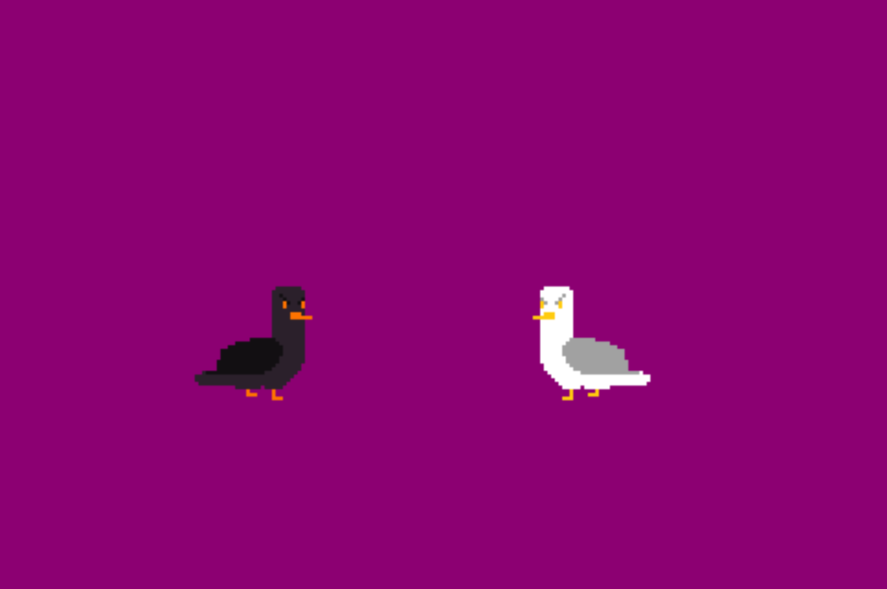

# Guilty Gull

Author: Joyce Zhang

Design: A (very minimalist) fighting game, the epic tale between a seagull and 
a crow fighting in a park.

Screen Shot:

## How Your Asset Pipeline Works:

### Source files: in dist folder
### Pipeline: 
**PNG <====> TILES <====> GAME SPRITE**
1. Data structure
in PlayMode.hpp, a data structure called *SpriteAtlas* is specificed, containing an array of to-be-loaded pngs
2. Load Function 
In PlayMode.cpp, a load function is created to load the PNGs into SpriteAtlas. Since I only have three files, the paths to those files are hardcoded, and read through load_png.
I have compressed my sprites into one big tile (when I can). attack_56_128 contains 4 possible animations of a sprite, stacked in a 1 * 4 grid. The other two files are ust 8*8, for no particular reason.
3. Parse into Tile
The majority of the parsing happens in the constructor of PlayMode. The helper lambda function (inappropriately titled ) ''load_single_tile'', loads an entire sprite. It takes in varaible sized sheets of data, and parses it into tile table.
The RGB channel corresponds to the 1, 2, 3 color of the color pallette. The color pallettes are hard coded. 
One special thing I did was that each sprite loaded also automatically loads a mirrored version. Since this is a fighting game and mirrored versions of the sprite are always present. 
4. Using it
Pretty standard, see Draw. The two function uses the same sprite but different colors, and switches animations.

How To Play:

player one(left):
A-D to move left and right
W to jump
C to attack

player one(right):
J-L to move left and right
I to jump
B to attack

Each player has three lives, getting hit three times and you're dead! 
(dead = you can't control your player anymore, sadly there's no death animation)

This game was built with [NEST](NEST.md).

